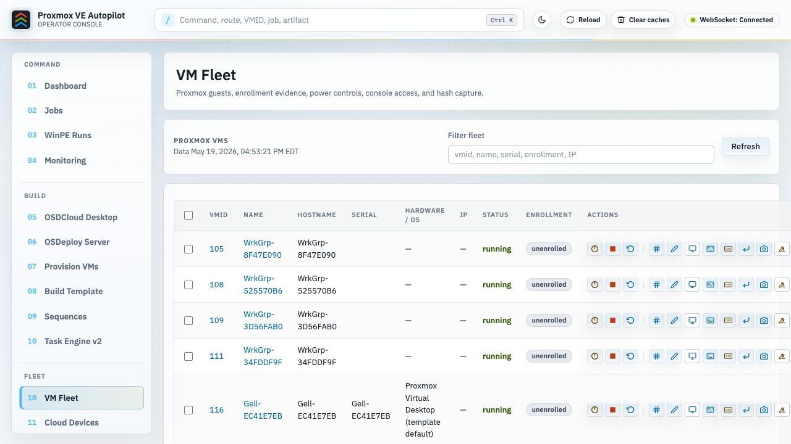
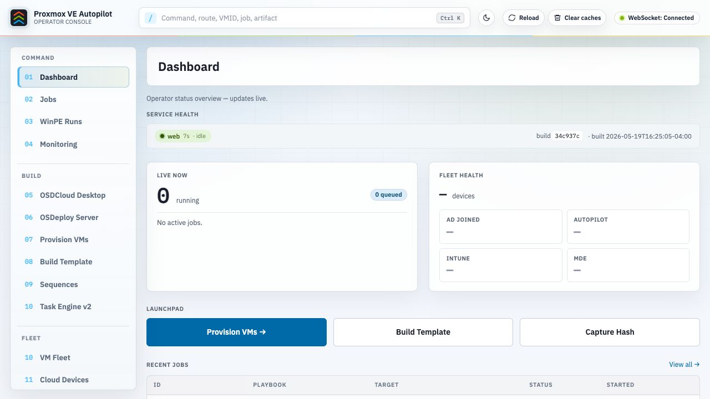
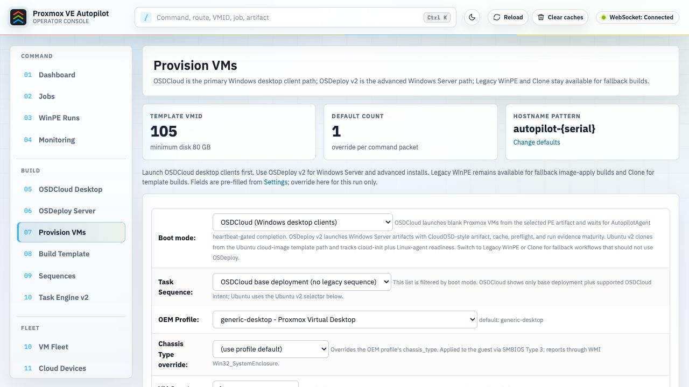
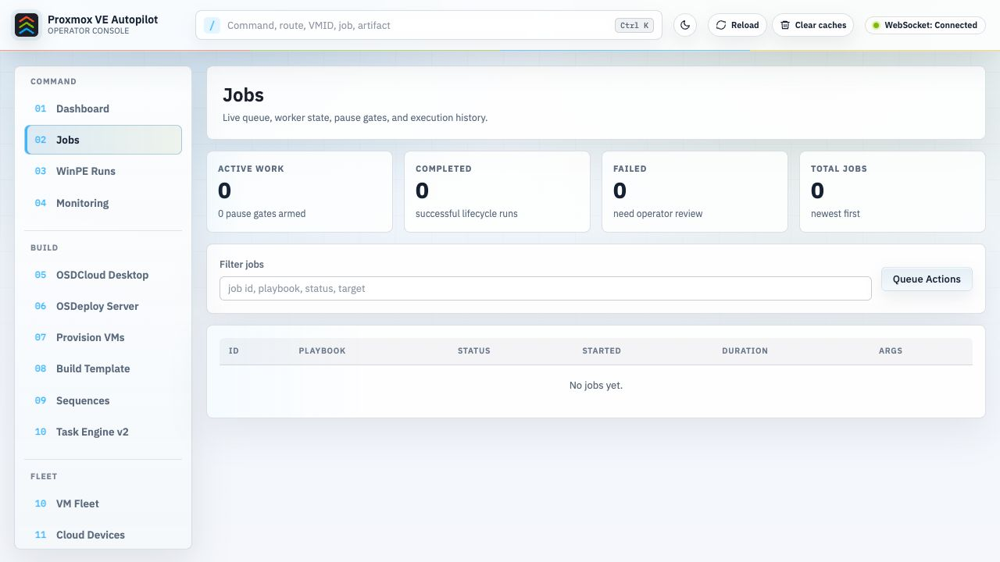
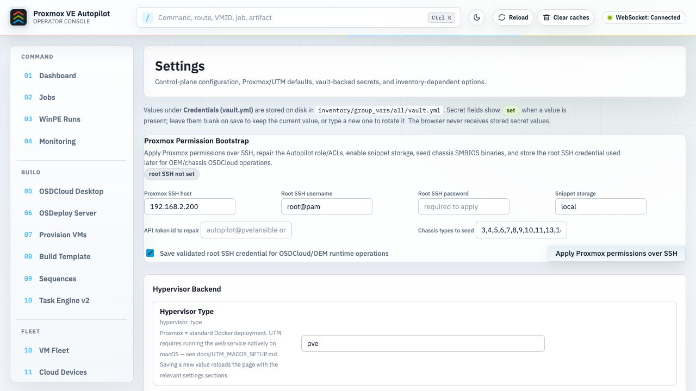
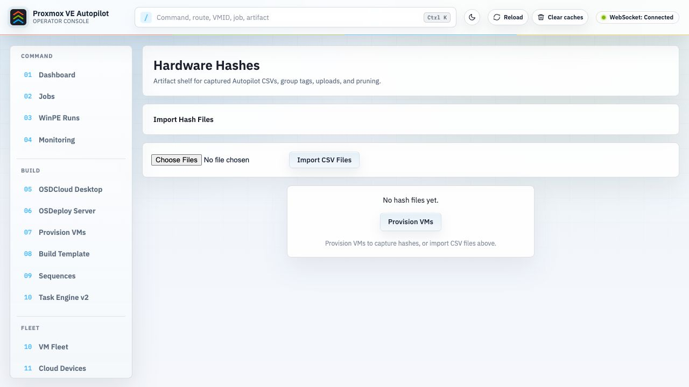

# Proxmox VE Autopilot

A web-based tool for provisioning Windows VMs on Proxmox with OEM-accurate SMBIOS fields and hardware hash capture for Windows Autopilot / Intune registration.



## What It Does

Proxmox VE Autopilot creates Windows VMs that appear as real OEM hardware to Windows Autopilot. Each VM gets manufacturer-specific SMBIOS fields (Lenovo, Dell, HP, Microsoft Surface, or generic), a unique serial number, and a hardware identity. The hardware hash is captured and uploaded to Intune — all from a browser, without touching a physical machine.

```
┌─────────────────┐     ┌──────────────────┐     ┌─────────────────┐     ┌──────────────────┐
│  Build Template │────>│   Clone VMs      │────>│  Capture Hashes │────>│  Upload to Intune│
│  (one-time)     │     │  (per device)    │     │  (per device)   │     │  (batch)         │
└─────────────────┘     └──────────────────┘     └─────────────────┘     └──────────────────┘
```

All communication with guest VMs happens through the Proxmox REST API and QEMU guest agent — no WinRM, no SSH, no network access to the guest required.

## Prerequisites

| Component       | Requirement                                          |
|-----------------|------------------------------------------------------|
| **Proxmox VE**  | 9.x with API access                                  |
| **Windows ISO** | Stock Windows 11 Enterprise / Business (unmodified)  |
| **VirtIO ISO**  | `virtio-win.iso` (latest from Fedora / Red Hat)      |
| **Docker host** | Any machine with Docker Compose, reachable on :5000  |

Both ISOs must already be uploaded to a Proxmox ISO storage (e.g. `isos`) before you start.

## Quick Start (5 steps)

### 1. Create a Proxmox API token

Run this on your **Proxmox host shell** (copy each line, not the whole block):

```bash
pveum role add AutopilotProvisioner -privs VM.Allocate,VM.Clone,VM.Config.CPU,VM.Config.CDROM,VM.Config.Cloudinit,VM.Config.Disk,VM.Config.HWType,VM.Config.Memory,VM.Config.Network,VM.Config.Options,VM.Audit,VM.PowerMgmt,VM.Console,VM.Snapshot,VM.Snapshot.Rollback,VM.GuestAgent.Audit,VM.GuestAgent.FileRead,VM.GuestAgent.FileWrite,VM.GuestAgent.FileSystemMgmt,VM.GuestAgent.Unrestricted,Datastore.AllocateSpace,Datastore.Audit,Sys.Audit,Sys.Modify,SDN.Use

pveum user add autopilot@pve --comment "Autopilot provisioning"
pveum user token add autopilot@pve ansible --privsep=0 --comment "Automation"
```

> **Save the token secret — Proxmox shows it once.** If you lose it, see [docs/TROUBLESHOOTING.md](docs/TROUBLESHOOTING.md#lost-my-api-token-secret).

Then grant the role on your storage and SDN zone (adjust names for your environment):

```bash
pveum acl modify / -user autopilot@pve -role AutopilotProvisioner
pveum acl modify /storage/ssdpool -user autopilot@pve -role AutopilotProvisioner
pveum acl modify /storage/isos -user autopilot@pve -role AutopilotProvisioner
pveum acl modify /sdn/zones/localnetwork -user autopilot@pve -role AutopilotProvisioner
```

Full breakdown, including how to find your storage and SDN names: [docs/SETUP.md](docs/SETUP.md#1-create-a-proxmox-api-token).

### 2. Configure credentials

```bash
git clone https://github.com/adamgell/ProxmoxVEAutopilot.git
cd ProxmoxVEAutopilot/autopilot-proxmox
cp inventory/group_vars/all/vault.yml.example inventory/group_vars/all/vault.yml
```

Open `vault.yml` and paste in the token id (`autopilot@pve!ansible`) and the secret you saved. Entra fields are optional — leave blank if you don't need Intune upload.

### 3. Start the container

```bash
docker compose up -d
```

Open the web UI at **http://your-host:5000**.

### 4. Configure Proxmox connection in the UI

On the **Settings** page, fill in:

- Proxmox host, port, node
- Storage (VM disks), ISO storage, network bridge
- Windows ISO and VirtIO ISO paths (dropdowns populate from Proxmox once the token is valid)
- VM defaults (cores, memory, disk, OEM profile)

Save. Leaving Settings empty will break the next step.

### 5. Build the answer ISO and template

On the **Build Template** page:

1. Click **Rebuild Answer ISO** — generates `autounattend.iso` from `files/autounattend.xml` and uploads it to Proxmox.
2. Click **Build Template** — Windows installs unattended (~20-30 min). Watch progress on the **Jobs** page.

Done. You can now clone devices from the **Provision VMs** page.

The app ships with three seeded **task sequences** — *Entra Join (default)*, *AD Domain Join — Local Admin*, and *Hybrid Autopilot (stub)*. The default reproduces today's Autopilot flow byte-for-byte; pick a different sequence on the Provision page to join a domain instead. See [docs/SETUP.md#task-sequences-and-credentials](docs/SETUP.md#task-sequences-and-credentials).

---

Stuck? Jump to [docs/TROUBLESHOOTING.md](docs/TROUBLESHOOTING.md). Need the full walkthrough with screenshots and field-by-field detail? See [docs/SETUP.md](docs/SETUP.md).

## Web UI

| | |
|---|---|
|  |  |
|  |  |
|  |  |

### Pages

| Page | Description |
|------|-------------|
| **Home** | Dashboard with running jobs and hash file count |
| **Provision VMs** | Clone VMs from the template with a selected task sequence, OEM profile, count, and group tag |
| **Devices** | View all Proxmox autopilot VMs and Intune Autopilot devices with inline actions |
| **Sequences** | Create and edit named **task sequences** — ordered lists of steps (set OEM, create local admin, Entra join, AD domain join, rename, run script, …) that define what happens during OOBE |
| **Credentials** | Encrypted store for reusable secrets — local admin passwords, AD domain-join accounts, ODJ blobs. Includes a **Test connection** button for domain-join credentials |
| **Build Template** | Rebuild the answer ISO and create a Windows template (one-time setup) |
| **Upload to Intune** | Upload captured hash files to Microsoft Intune |
| **Hash Files** | Browse, download, and delete captured hardware hash CSVs |
| **Import Hashes** | Upload hash CSV files from your local machine |
| **Jobs** | View all running and completed jobs with live log streaming |
| **Settings** | Configure Proxmox connection, VM defaults, and timeouts |

### VM actions (Devices page)

| Action | Description |
|--------|-------------|
| **Start** | Power on a stopped VM |
| **Shutdown** | ACPI graceful shutdown (with confirmation) |
| **Force Stop** | Immediate power off (with confirmation) |
| **Reset** | Reboot the VM |
| **Capture Hash** | Run hash capture via guest agent |
| **Rename** | Rename Windows hostname to match the VM serial |
| **Console** | Open Proxmox noVNC console |
| **Delete** | Stop and remove the VM (with confirmation) |

Select multiple VMs to capture hashes in parallel — each VM gets its own independent job, so one failure doesn't affect the others.

## OEM Profiles

13 built-in profiles in `autopilot-proxmox/files/oem_profiles.yml`:

| Key                   | Manufacturer          | Product                    | Chassis  |
|-----------------------|-----------------------|----------------------------|----------|
| `lenovo-p520`         | Lenovo                | ThinkStation P520          | Desktop  |
| `lenovo-t14`          | Lenovo                | ThinkPad T14 Gen 4         | Notebook |
| `lenovo-x1carbon`     | Lenovo                | ThinkPad X1 Carbon Gen 11  | Notebook |
| `dell-optiplex-7090`  | Dell Inc.             | OptiPlex 7090              | Desktop  |
| `dell-latitude-5540`  | Dell Inc.             | Latitude 5540              | Notebook |
| `dell-xps-15`         | Dell Inc.             | XPS 15 9530                | Notebook |
| `hp-elitedesk-800`    | HP                    | EliteDesk 800 G8 SFF       | Desktop  |
| `hp-elitebook-840`    | HP                    | EliteBook 840 G10          | Notebook |
| `hp-zbook-g10`        | HP                    | ZBook Fury 16 G10          | Notebook |
| `surface-pro-10`      | Microsoft Corporation | Surface Pro 10             | Laptop   |
| `surface-laptop-6`    | Microsoft Corporation | Surface Laptop 6           | Notebook |
| `generic-desktop`     | Proxmox               | Virtual Desktop            | Desktop  |
| `generic-laptop`      | Proxmox               | Virtual Laptop             | Notebook |

Each profile sets SMBIOS type 1 fields and generates a manufacturer-appropriate serial number prefix (Lenovo=PF, Dell=SVC, HP=CZC, Microsoft=MSF).

## More Documentation

- **[docs/SETUP.md](docs/SETUP.md)** — detailed setup walkthrough with field-by-field configuration, unattended-install internals, and an air-gapped answer-ISO recipe.
- **[docs/TROUBLESHOOTING.md](docs/TROUBLESHOOTING.md)** — symptoms, causes, and fixes for common failures.
- **[autopilot-proxmox/README.md](autopilot-proxmox/README.md)** — Ansible CLI usage, playbooks, and developer reference.
